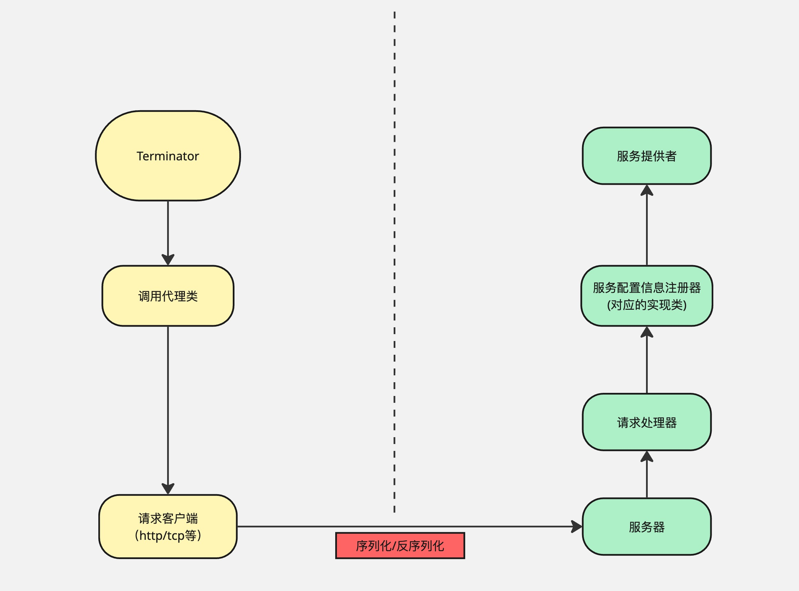

# PoYang RPC 框架

## 📌 项目简介

**PoYang** 是一个基于 **Java + Vert.x + Etcd** 构建的高性能 RPC 框架。它融合了 Dubbo 与 Spring Boot 的设计思想，涵盖了反射、动态代理、SPI 扩展、序列化、负载均衡、容错机制等核心功能，旨在提供一个可扩展、轻量级的微服务通信解决方案。

> 🧠 该项目是对 RPC 底层原理的完整实践，从 0 到 1 独立实现，完善了作为RPC框架的该有基本功能。

---

## ⚙️ 架构图

---

## 🛠️ 技术选型与功能亮点

### 🔌 网络通信

- 基于 **Vert.x** 实现异步高性能网络通信（底层使用 Netty）
- 自定义 RPC 协议编解码器

### 🧭 注册中心

- 默认集成 **Etcd**（基于 jetcd）
- 设计上支持切换至 Zookeeper、Consul 等

### 📦 多种序列化方式（支持 SPI 动态扩展）

- JSON
- Kryo
- Hessian
> ✅ 预留扩展支持：Protobuf、Avro 等

### 🧱 设计模式应用

- 单例模式（双检锁）
- 工厂模式
- 代理模式
- 装饰者模式
- SPI 插件机制

### 🎯 负载均衡策略

- ✅ 随机负载均衡（Random）
- ✅ 轮询负载均衡（Round Robin）
- ⏳ 待实现：
  - 加权轮询（Weighted Round Robin）
  - 最少连接数（Least Connections）

### 🛡️ 容错与稳定性设计

部分已实现，部分规划中：

- 快速失败（Fast-Fail）
- 安全退避（Fast-Safe）
- 自动重试（Retry）
- 降级处理（Fallback）
- 熔断机制（Circuit Breaker）
- 隔离舱模式（Bulkhead）
- 超时控制（Timeout Control）
- 幂等控制（Idempotency）

### 🌱 Spring Boot Starter 支持

- 提供 starter 模块
- 支持注解驱动
- 简化集成与自动化配置

---

## 🔭 待扩展功能

- 支持更多配置文件格式（XML、YAML、Properties）
- 支持更多注册中心（Zookeeper、Consul）
- 支持更多序列化方式（Avro、Protobuf）
- 拓展负载均衡与容错策
